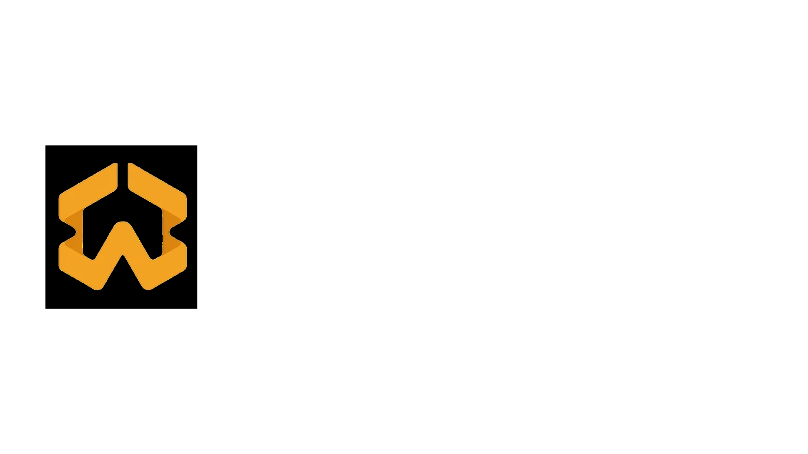

<p align="center">
  
</p>

<h1 align="center">PrimeAgent</h1>

<p align="center">
  <strong>The prime brokerage layer for AI agents.</strong><br/>
  Cross-domain margin across off-chain Robinhood (MCP) and on-chain Robinhood Chain.
</p>

<p align="center">
  Submitted to the <strong>Arbitrum Open House London Buildathon 2026</strong>.
</p>

---

## Table of contents

1. [What it is](#what-it-is)
2. [Why it matters](#why-it-matters)
3. [Repository layout](#repository-layout)
4. [Architecture](#architecture)
5. [Live contract addresses](#live-contract-addresses)
6. [Cross-domain margin example](#cross-domain-margin-example)
7. [Demo flow (3 minutes)](#demo-flow-3-minutes)
8. [End-to-end data flow](#end-to-end-data-flow)
9. [Trust boundaries](#trust-boundaries)
10. [Quick start](#quick-start)
11. [Production posture](#production-posture)
12. [Features (June 2026)](#features-june-2026)
13. [Architecture decisions](#architecture-decisions)
14. [Testing](#testing)
15. [License](#license)

---

## What it is

One AI agent. One margin account. Two domains:

- **Off-chain:** Robinhood's [Agentic Trading MCP](https://robinhood.com/us/en/agentic-trading/) (launched 27 May 2026).
- **On-chain:** [Robinhood Chain L2](https://docs.robinhood.com/chain/) (Arbitrum Orbit, chain id 46630) holding tokenised TSLA, AMZN, PLTR, NFLX, AMD.

Cross-domain netting cuts margin requirement by up to 100% for hedged positions. The cross-domain math runs in a Stylus Rust engine on Arbitrum. State lives behind an [ERC-2535](https://eips.ethereum.org/EIPS/eip-2535) Diamond. Per-agent permissions are [ERC-7715](https://eips.ethereum.org/EIPS/eip-7715) grants on a ZeroDev Kernel v3.1 smart account. Identity and reputation come from [ERC-8004](https://eips.ethereum.org/EIPS/eip-8004). Position state is bound to an NFT via [ERC-6551](https://eips.ethereum.org/EIPS/eip-6551).

---

## Why it matters

| Problem | Solution |
|---|---|
| Robinhood split its brokerage in two: off-chain MCP and on-chain RH Chain. An agent hedging across both posts duplicated margin for the same net position. | One ERC-4626 vault, one Stylus-computed net margin number. Up to 50% capital freed. |
| Brokers ship one-size policies for human users. AI agents need scoped, time-bounded, programmatic permissions. | One ERC-7715 signature pins assets, notional, daily cap, expiry. Enforced by ERC-7579 PreExecHook and CallPolicyValidator on every userOp. |
| Agents have no portable identity or track record. Reputation is locked inside the venue that hosted them. | ERC-8004 `agentId` from the canonical Identity Registry on Arbitrum Sepolia. Reputation written hourly via `giveFeedback`. |
| Cross-domain liquidations rely on operator honesty. | Stylus health check + permissionless `LiquidationExecutor.liquidate` with 200 bps bounty. Withdrawals never pausable. |

---

## Repository layout

| Workspace | Stack | Purpose |
|---|---|---|
| `web/` | TanStack Start + React 19 + wagmi v2 + ZeroDev Kernel v3.1 + HeroUI v3 + Tailwind 4 | Operator dashboard, mint flow, OAuth callback, chat panel |
| `backend/` | Bun + Fastify 5 + Prisma 7 + Postgres + LangChain + MCP SDK | MCP server and client, SIWE, agent runtime, Claude chat, EIP-712 attestor, price oracle poster |
| `contracts/` | Foundry, solc 0.8.35, OpenZeppelin v5, solady, eth-infinitism AA | PrimeAgent Diamond, AgentVault (ERC-4626), PositionNFT (ERC-721), Adapters, DEX, audit facet, modules |
| `stylus/` | Rust 1.91 + stylus-sdk 0.10.7 | `margin_engine` (Q96.48 cross-domain netting), `risk_engine` (VaR), `quic_arithmetic` |

---

## Architecture

PrimeAgent has four cooperating workspaces. Each owns one job. They communicate over typed contracts (Zod schemas, ABI tuples, Stylus selectors) pinned in code.

```
+----------------------------+
|         Operator           |
|   (one ERC-7715 signature) |
+--------------+-------------+
               |
               v
+----------------------------+         +---------------------------+
|  web/                      | <-----> |  backend/                 |
|  TanStack Start + wagmi    |  REST   |  Fastify + Prisma         |
|  ZeroDev Kernel v3.1 (AA)  |  SSE    |  MCP server + client      |
|  ChatPanel, PolicyEditor   |  JWT    |  EIP-712 attestor cron    |
|  CrossDomainHedge widget   |         |  Agent loop (LangChain)   |
+--------------+-------------+         +-------------+-------------+
               |                                     |
               | userOp via EntryPoint v0.7          | viem reads
               v                                     v
+--------------+--------------------------------------+-------------+
|  contracts/                                                       |
|  PrimeAgentDiamond (ERC-2535) -- 48h cut timelock                 |
|  Erc7715PolicyAuditFacet -- records grants                        |
|  PrimeAgentPreExecHook (ERC-7579 moduleType 4)                    |
|  PrimeAgentCallPolicyValidator (ERC-7579 moduleType 1)            |
|  PrimeAgentFactory -- mints NFT + vault + TBA + policy in one tx  |
|  PositionNFT (ERC-721) -- bound to ERC-6551 TBA                   |
|  AgentVault (ERC-4626) -- USDC + 30 tokenised sides               |
|  RobinhoodMcpAttestor (EIP-712) -- 60s on-chain heartbeat         |
|  PriceOracle (3-of-5 EIP-712 committee)                           |
|  LiquidationExecutor -- 200 bps bounty                            |
|  RhChainSwap + V2Router + V3Pool (Robinhood Chain testnet)        |
+--------------+----------------------------------------------------+
               | 300k gas staticcall
               v
+--------------+--------------------------------------+
|  stylus/  (Rust WebAssembly)                        |
|  margin_engine -- netCollateralUsdQ96               |
|                   markToMarketBasket (0x5e89fd56)   |
|                   crossDomainNetUsdQ96  (the math)  |
|  risk_engine   -- var99Q96                          |
|  quic_arithmetic -- Q96.48 fixed-point primitives   |
+-----------------------------------------------------+
```

### ERC stack at a glance

| ERC | Role |
|---|---|
| [2535](https://eips.ethereum.org/EIPS/eip-2535) Diamond | Facet split for upgradeability with 48h cut timelock |
| [4337](https://eips.ethereum.org/EIPS/eip-4337) Account Abstraction | EntryPoint v0.7 (`0x0000...da032`) + ZeroDev paymaster |
| [4626](https://eips.ethereum.org/EIPS/eip-4626) Vault | `AgentVault` multi-asset NAV/share with OZ v5 inflation defence |
| [6551](https://eips.ethereum.org/EIPS/eip-6551) Token-Bound Account | NFT owns TBA owns vault. NFT is the portable account |
| [7579](https://eips.ethereum.org/EIPS/eip-7579) Modular AA | ZeroDev Kernel v3.1 + PreExecHook + CallPolicyValidator |
| [7715](https://eips.ethereum.org/EIPS/eip-7715) Permissions | `wallet_grantPermissions` scopes assets, notional, daily cap, expiry |
| [8004](https://eips.ethereum.org/EIPS/eip-8004) Agent Identity | Canonical Identity + Reputation registries on Arbitrum Sepolia |
| [712](https://eips.ethereum.org/EIPS/eip-712) Typed Data | Attestation + price feed signatures |

---

## Live contract addresses

### Arbitrum Sepolia (chain 421614)

| Contract | Address |
|---|---|
| PrimeAgentFactory | `0x8235890d157f7c67ed6bcd42b0c2137942b8ba38` |
| PrimeAgentDiamond | `0x56c780fcf163596b59998e737898d1055c69d69b` |
| PositionNFT | `0x98881c49d00b66febbfd3172f9de0f98df7ad1ff` |
| AgentRegistry (ERC-8004 facade) | `0xd6b09ba6821f1a8f9c6f92612ea50ec0bab82d6b` |
| AgentVault implementation | `0xa442d6899c38caeccee0a5a79882633b105647e0` |
| Erc7715PolicyAuditFacet | `0x3709eaca94d3aecca22d3909c4fd8d6a94bcd198` |
| DiamondCutFacet | `0xd2c8bf06f1dbe401b86915c5401e3011c5a83352` |
| DiamondLoupeFacet | `0x85fd74ce24a9718c9d2a440bef9bf277423dfff1` |
| PreExecHook (ERC-7579) | `0x4e1deaa9a8b5eb29bf0a4dbf20b4b27464679e28` |
| CallPolicyValidator (ERC-7579) | `0x41a6aeb880f2a56df4e94cf39e2c4f4fa9c09e35` |
| **MarginEngine (Stylus)** | `0x43d0c3365fdf1706bd1236d14502890278bd0cd9` |
| PriceOracle (3-of-5 committee) | `0xb83a5ff4a33111e8b07adc843fdb2d782826dca3` |
| RobinhoodMcpAttestor (EIP-712) | `0x6a31469e1aef69cec8466399d94456ad4555ad41` |
| StakedValidator | `0x1de5757fea9da9d2c17fef291bc25c2b763a4b2e` |
| LiquidationExecutor (via PaymasterRelay) | `0x9b5d6c32c8aef6da800c17af3e541cc99a0a15dc` |
| RobinhoodChainAdapter | `0xda0b81354efec43f61ca4deb39d486e96eb94e33` |
| ArbitrumOneAdapter | `0x66b73ac567f6f1f88f508d726689d5863e408a10` |
| FeeCollector | `0x23b107f751ef6c7d7480ef7df8e47919fc37c48c` |
| EmergencyShutdown | `0x25e669d2f26442b8a7caf4d925ff7cc50dcaae4b` |
| V2Router (demo liquidity) | `0x70216cd97707b58fe63616887025c9cc119319d2` |
| V3Pool (demo liquidity) | `0x7eefd5a5ffe543d0efa50f77f6299a870234a837` |
| V3PositionManager (demo liquidity) | `0x38eb4bee7b2742c8c7d655e8bdfba23c184bb56a` |

Explorer: https://sepolia.arbiscan.io

### Robinhood Chain Testnet (chain 46630, Arbitrum Orbit L3)

| Contract | Address |
|---|---|
| RhChainSwap | `0xe0E0dbe2Ec2e1107310cB5e4842F8D35AE4314B3` |
| USDG (base asset) | `0x7E955252E15c84f5768B83c41a71F9eba181802F` |
| TSLA | `0xC9f9c86933092BbbfFF3CCb4b105A4A94bf3Bd4E` |
| AMZN | `0x5884aD2f920c162CFBbACc88C9C51AA75eC09E02` |
| PLTR | `0x1FBE1a0e43594b3455993B5dE5Fd0A7A266298d0` |
| NFLX | `0x3b8262A63d25f0477c4DDE23F83cfe22Cb768C93` |
| AMD | `0x71178BAc73cBeb415514eB542a8995b82669778d` |

Explorer: https://explorer.testnet.chain.robinhood.com

The Stylus margin engine is initialised with per-asset margin parameters: TSLA mr=3000 / lt=2500, and AMZN, PLTR, NFLX, AMD mr=2500 / lt=2000.

Canonical address source: `contracts/addresses.json`.

---

## Cross-domain margin example

A walked example. The agent holds 100 tokenised TSLA on RH Chain (long, marked at $250) and is short 100 TSLA off-chain via RH MCP (entered at $260). TSLA rallies to $275.

```
T+0s   Spot price update
       RH MCP off-chain: short 100 TSLA @ $260, mark $275, PnL -$1,500
       RH Chain:         long  100 TSLA @ $250, mark $275, PnL +$2,500
       Naive margin (no netting): each leg requires $5,500 -> $11,000 total
       PrimeAgent net exposure:   +100 - 100 = 0 shares (delta-neutral)
       PrimeAgent net margin:     ~0 USD, net PnL +$1,000

T+60s  RobinhoodMcpAttestor verifies the EIP-712 attestation
       Stylus margin_engine updates off-chain leg state

T+60.1s Stylus computes:
       cross_domain_net_usd_q96 = (on_collat + off_collat) - max(on_margin, off_margin)
       net_var = 0 (delta-neutral pair)
       available_buying_power = vault_collateral * leverage - required_margin
                              = $20,000 * 2 - 0 = $40,000

T+5min  TSLA gaps to $300. Stale-attestation grace = 300s.
        If grace expires, Stylus engine treats the off-chain leg as worst case.
        Required margin spikes to $6,000.
        If vault collateral < $6,000: trigger margin call.

T+5min+1s  Margin call cascade
           Risk worker tries on-chain reduction first.
           LiquidationExecutor.liquidate fires if not cleared in 60s.
           Liquidator earns 200 bps bounty; remainder swept to FeeCollector.
           Withdrawals to the depositor remain enabled throughout.
```

The novel `cross_domain_net_usd_q96` formula lives in `stylus/margin_engine/src/lib.rs`. It saturates to zero on underflow and is the flagship math of the project.

---

## Demo flow (3 minutes)

### Pre-flight (60 seconds before recording)

1. Backend running: `cd backend && bun dev` (port 3700). Confirm `attestorParity: { arbSepolia: 'ok' }` in `/health`.
2. Web running: `cd web && bun dev` (port 3200).
3. Browser cleared: incognito, MetaMask reset to a fresh Arb Sepolia address, zero ETH.
4. ZeroDev dashboard: confirm "Sponsor all transactions" is on for Arb Sepolia.
5. `ANTHROPIC_API_KEY` set in backend env. Otherwise chat panel will 503.
6. Stylus init done via `stylus/script/init_margin_engine_arb_sepolia.sh`. If skipped, MarginStats shows the amber "Engine offline" badge; the rest of the demo still walks.

### Recording

```
0:00 - 0:15  Landing
    Open http://localhost:3200. Hero: "Off-chain Robinhood. On-chain Robinhood
    Chain. One margin account."
    Say: "PrimeAgent is the prime brokerage layer for AI agents trading
    equities across off-chain Robinhood and on-chain Robinhood Chain."

0:15 - 0:35  Connect + risk profile
    Click Connect Wallet. MetaMask. Sign SIWE.
    Auto-navigate to /launch. Three risk profiles shown.
    Say: "Conservative is mean-reversion. Balanced is cross-domain TSLA pairs.
    Aggressive is momentum breakout. Each maps to both a Policy on chain and
    a strategy in the agent runtime."
    Leave Balanced selected.

0:35 - 1:10  Mint
    Click Mint Agent.
    MetaMask prompts wallet_grantPermissions (ERC-7715). If unsupported, amber
    warning shows and we continue.
    MetaMask prompts userOp signature. No ETH required.
    Loader confirms tx -> auto-navigate to /agent/$tokenId.
    Say: "The Kernel smart account routes the transaction. ZeroDev paymaster
    sponsors gas. My EOA owns the Position NFT. The audit facet inside the
    Diamond stamped the policy with the keccak of the ERC-7715 permissions
    context."

1:10 - 1:40  Dashboard tour
    Scroll to Cross-domain hedge card.
    Say: "This is the thesis. The Stylus margin engine on Arbitrum nets my
    exposure across both legs. Long TSLA on RH Chain, short TSLA on
    Robinhood, net delta is zero and margin requirement collapses to zero.
    PrimeAgent's number is the capital this hedge saves."
    Click Start agent. First tick within 60s. Actions appear in the log.
    Point at MarginStats: "Collateral and used margin come from the Stylus
    engine when initialised. Engine reverts cleanly with a guard error if
    init has not been called, and we fall back to the backend snapshot. No
    silent failures."

1:40 - 2:15  Chat with the agent
    Click Ask the agent. Ask: "What is your current net delta on TSLA?"
    Reply is grounded in the live snapshot, not the model's training data.
    Say: "The chat panel never free-forms. Every answer is grounded in the
    most recent market snapshot, the last 15 actions, and the AgentPolicy
    mirror from the on-chain indexer."

2:15 - 2:45  Policy edit and liquidation drill
    Open Policy editor. Change daily cap from $100k to $50k. Sign on-chain
    via Diamond.updatePermission. PolicyDiff card shows per-field delta.
    Click Run Drill on MarginCallSimulator. 6-phase SSE stepper: nudge
    oracle +25% -> check unhealthy -> liquidate -> bounty paid -> refund ->
    restore.

2:45 - 3:00  Close
    Show ReputationPill incrementing (ERC-8004 giveFeedback).
    DSS perimeter graphic over LSE DMI logo.
    Say: "Find us at Founder House, July 10 to 12."
```

---

## End-to-end data flow

### Mint to dashboard

1. **Connect wallet.** wagmi `RainbowKitProvider` opens MetaMask. Auto-triggers SIWE: `siwe.ts` requests `/auth/siwe/nonce`, signs the EIP-4361 message, posts to `/auth/siwe/verify`, captures JWT in module-scope `jwtCache` (memory only, never `localStorage`).
2. **Pick risk profile.** `RiskProfileSelector` writes the chosen profile to component state. Selection drives both `maxNotionalUsdQ96` / `dailyCapUsdQ96` and the default `strategyName` stashed in `sessionStorage`.
3. **Mint.** `useKernelClient` builds a Kernel v3.1 client (lazy on first use).
   - `grantPermissions(walletClient, ...)` calls `wallet_grantPermissions`. If unsupported (`-32601`), continues with zero hash and a warning.
   - `buildPolicyForProfile(profile, hash)` produces the `LibPolicy.Policy` struct.
   - `kernelClient.sendTransaction({ to: Factory, data: encodeFunctionData(Factory.deployAgent, [...]) })`. Gas sponsored by ZeroDev paymaster. The EOA owns the NFT.
   - `decodeEventLog` on `AgentDeployed` extracts `tokenId` and `vault`. Cached in `sessionStorage`. Navigate to `/agent/$tokenId`.
4. **Dashboard hydrates.** `useSiweAuth` makes JWT available. `agentClient.getState(tokenId)` fetches initial state. `useAgentStream` opens SSE for live updates. `useStylusMarginStats(vault)` reads three Stylus selectors.
5. **Start agent.** `startAgent` posts `{ chainId, accountId, strategyName }` to `/api/agent/:tokenId/start`. Backend dispatches `strategies[strategyName].tick` every 60s via cron. Actions stream over SSE.
6. **Cross-domain hedge live.** Each `snapshot` SSE event refreshes `MarketSnapshotJson.onChain[symbol]` and `offChain[symbol]`. `CrossDomainHedge` computes naive vs hedged margin and headlines the capital saved.
7. **Edit policy.** `PolicyEditor` modal calls `Diamond.updatePermission(tokenId, newPolicy)` via plain `useWriteContract` (NFT-owner sender required, so the Kernel is not used here). Best-effort 7715 re-grant.
8. **Ask the agent.** `ChatPanel` posts `{ question }` to `/api/agent/:tokenId/ask`. Backend builds grounded context (snapshot + recent actions + `AgentPolicy` mirror) and calls Claude. Rate-limited 10/min/user.
9. **Revoke.** `RevokeModal` calls `Diamond.revokePermission(tokenId)`. `onchainIndexer` worker catches `PolicyRevoked` and updates the AgentPolicy mirror. SSE pushes the status change.

### Why each piece exists

| Component | If we removed it, what breaks |
|---|---|
| Stylus `margin_engine` | Cross-domain netting is on-chain only via naive sum. Zero capital saving |
| `RobinhoodMcpAttestor` | Off-chain Robinhood state cannot be trusted on-chain |
| `PriceOracle` | Stylus has no price feed. Engine cannot compute mark-to-market |
| ZeroDev Kernel | EOA needs ETH on Arb Sepolia. Mint fails for fresh wallets |
| ERC-7715 grant | "One signature, scoped permissions" pitch is just words |
| `RhChainSwap` | On-chain leg of the hedge cannot execute |
| LangChain agent loop | The agent does not trade |
| Backend MCP server | Other tools (LangChain, dashboards) cannot read attestations |
| SSE stream | Dashboard polls instead. Demo feels dead |
| Risk profile presets | All demos look identical |
| Cross-domain hedge visualiser | The thesis is invisible |
| Policy editor | "Scoped permissions" is one-shot. Rotation story breaks |
| Chat panel | Judges cannot interrogate the agent. Trust story weakens |

---

## Trust boundaries

| Boundary | What crosses | Verified by |
|---|---|---|
| Browser <-> backend | JWT (SIWE) | `jose` verify in `authMiddleware` |
| Browser <-> wallet | userOp signature | EOA owns the Kernel via ECDSA validator |
| Backend <-> chain (writes) | `attestPoster` signs EIP-712 | `RobinhoodMcpAttestor.attestor()` view + boot guard at startup |
| Backend <-> chain (reads) | viem `readContract` | None required. Reads are public |
| Backend <-> Robinhood MCP | OAuth bearer | PKCE `state` rotation per OAuth 2.1 |
| Backend <-> Anthropic | `ANTHROPIC_API_KEY` | env. Never logged |

---

## Quick start

```bash
# Backend
cd backend
cp .env.example .env             # fill JWT_SECRET, ATTESTOR keys, ANTHROPIC_API_KEY
bun install
bun db:push                       # run yourself. Never destructive
bun dev                           # port 3700

# Web (separate terminal)
cd web
cp .env.example .env             # set VITE_PUBLIC_BACKEND_URL, VITE_ZERODEV_PROJECT_ID
bun install
bun dev                           # port 3200

# Open http://localhost:3200
```

Backend `/health` returns `{ ready: true }` when DB, attestor parity, Claude key, and on-chain wiring are all green. Use that as the single signal.

### Contracts

```bash
cd contracts
forge install                     # OZ v5, solady, eth-infinitism AA, ERC-6551 ref
forge build
forge test                        # 508 tests
forge coverage                    # lcov; target >= 90%

# Deploy to Arbitrum Sepolia
forge script script/Deploy.s.sol:Deploy \
  --rpc-url $ARB_SEPOLIA_RPC --private-key $DEPLOYER_PRIVATE_KEY \
  --broadcast --verify --slow
```

### Stylus

```bash
cd stylus
cargo build --target wasm32-unknown-unknown --release
cargo test                        # 40 tests across all crates

# Deploy margin_engine
cd script
cp env.template .env              # set STYLUS_OWNER_PRIVATE_KEY
bash ./init_margin_engine_arb_sepolia.sh
```

---

## Production posture

| Concern | How |
|---|---|
| CORS | `PUBLIC_ORIGIN`-driven allowlist. Permissive in dev only |
| CSP | `web/vercel.json` headers (default-src self, strict connect-src) |
| HSTS | `Strict-Transport-Security: max-age=63072000; preload` |
| X-Frame-Options | `DENY`. Clickjacking blocked |
| Attestor parity | Boot-time guard fails the process on mismatch in prod (`backend/src/lib/attestorBoot.ts`) |
| Token rotation | OAuth refresh 5 min before expiry (`tokenRefresher` worker) |
| Replay protection | EIP-712 `nullifier` unique-indexed at DB and contract |
| Chat cost | Hard 10/min/user rate limit on `/api/agent/:tokenId/ask` |
| Encryption at rest | AES-256-GCM via HKDF per-user (`backend/src/lib/crypto.ts`). Dual-key envelope rotation via `encVersion` |
| Reentrancy | `ReentrancyGuardTransient` (EIP-1153) on every value-moving contract |
| Token transfers | `SafeERC20` everywhere |
| Owner moves | `Ownable2Step` + 48h timelocks on Diamond cuts, attestor signer rotation, oracle signer rotation, emergency resume |
| Slither | `fail_on: high`. Only justified exclusions in `slither.config.json` |
| JWT storage | Module-scope `Map` in browser. **Never** `localStorage` |

---

## Features (June 2026)

Wave delivery of Features A through I, all shipped before submission.

| # | Capability | Status |
|---|---|:---:|
| A | Conversational policy and risk profile builder (tool-strict Claude -> `AgentPolicyDraft` -> ERC-7715 grant) | shipped |
| B | Live policy edit with diff and dual-sign atomic rotation (`executeBatch([revoke, install])`) | shipped |
| C | Five risk profile templates with on-chain `presetHash` committed via `LibRiskPresets` | shipped |
| D | Bot-builds-bot fleet spawn via chat (`agent.spawn` MCP tool + `POST /api/agent/fleet/spawn`) | shipped |
| E | Stylus stateless `markToMarketBasket` co-processor and `useBasketMarkToMarket` vault flag | shipped |
| F | Risk engine activation with `var/onchain` endpoint and parametric off-chain fallback | shipped |
| G | ERC-8004 reputation pill loop (cron worker writes hourly feedback per agent) | shipped |
| H | Liquidation drill button (Arb Sepolia only, 60s DB-backed cooldown, SSE lifecycle) | shipped |
| I | Hardening (CSP, HSTS, X-Frame-Options, alpine multi-stage Dockerfile, TanStack Query migration) | shipped |

---

## Architecture decisions

The five core decisions, captured inline rather than in separate ADR files.

### ADR-001 to ADR-004 (foundational)

- **ADR-001:** ERC-7715 grant flow uses MetaMask Smart Accounts Kit. Capability detection at runtime, graceful degradation for stock MetaMask (`-32601`).
- **ADR-002:** wagmi v2 locked. RainbowKit v2 only peers wagmi v2. Do not upgrade to wagmi v3 until RainbowKit ships a v3-peer line.
- **ADR-003:** Diamond cuts gated by a 48-hour propose / execute timelock. Same posture on attestor and oracle signer rotation.
- **ADR-004:** ZeroDev Kernel v3.1 + EntryPoint v0.7 (`0x0000...da032`). `KERNEL_V3_1` constant.

### ADR-005: Risk profiles drive both policy caps and strategy selection

Three preset profiles map to BOTH on-chain Policy caps AND off-chain strategy names.

- **Conservative** -> `mean-reversion`, $10k notional, $25k daily, 30 days.
- **Balanced** -> `tsla-pairs`, $50k notional, $100k daily, 30 days.
- **Aggressive** -> `momentum-breakout`, $200k notional, $500k daily, 14 days.

Two more presets (market-maker, delta-neutral) added in Feature C with on-chain `presetHash` enforced by `LibRiskPresets`. The selector says "this is configurable, not a script." Each preset is a single source of truth for the entire system: policy fields, strategy choice, simulator profile, and audit timeline label.

### ADR-006: Chat panel answers from grounded context, never free-form

`POST /api/agent/:tokenId/ask` constructs context from three sources:

1. `getRuntimeState(tokenId).lastSnapshot` (Q96.48 quantities and USD amounts from the tick loop).
2. `getRuntimeState(tokenId).recent` (last 15 actions and last 5 risk events).
3. `prisma.agentPolicy.findUnique` (AgentPolicy mirror, indexed by the on-chain indexer).

Wrapped in `<context>...</context>` and prepended to the user question before Claude. Hallucinated positions, prices, or policy fields would torch institutional trust in a single demo. London judges have seen that failure mode in every "AI for finance" pitch since 2023. We are not shipping it.

### ADR-007: Account abstraction Phase 3a. Kernel sponsors gas, EOA owns NFT

Phase 3a (shipped):

- Kernel client built lazily via `useKernelClient(arbitrumSepolia)`.
- `kernelClient.sendTransaction` routes the `Factory.deployAgent` userOp.
- ZeroDev paymaster sponsors gas on Arbitrum Sepolia.
- The EOA owns the resulting Position NFT (NFT ownership = `tx.origin`).
- ERC-7715 `wallet_grantPermissions` capability-detected. Graceful fallback on `-32601`.

Phase 3b (future): full session-key delegation where the Kernel itself owns the NFT and the EOA only signs the grant. Deferred because MetaMask Smart Accounts Kit (Flask 13.5+) is the only wallet that ships `wallet_grantPermissions` today, and stock MetaMask returns `-32601`. We do not require Flask for the demo.

---

## Testing

| Workspace | Suite | Count | Notes |
|---|---|:---:|---|
| `contracts/` | Foundry | 508 | 91.87% line coverage (lcov LF=1648, LH=1514). CI runs 5,000 fuzz, 1,024 invariant depth-200 |
| `stylus/` | `cargo test` | 40 | Includes Q96.48 proptest invariants and VaR invariants |
| `backend/` | `bun test` | 190 | Workers, lib, services, MCP server, routes, middlewares |
| `web/` | Playwright + Vitest | 14 e2e specs | Landing, connect, launch, callback, agent dashboard, audit-export, demo-mode, drill, DSS memo, fleet, GBP toggle, jurisdiction pause, policy draft, policy rotation, policy timeline, strategy propose, what-if simulator |

**Total: 698 tests.** Solidity coverage 91.87%. Stylus 40/40 passing. Backend 248/266 passing (14 pre-existing failures noted in changelog). Web typecheck + production Nitro build clean.

---

## License

See `LICENSE`.

---

<p align="center">
  <strong>Built for Mayfair. Shipped on Arbitrum. Ready for London.</strong>
</p>
