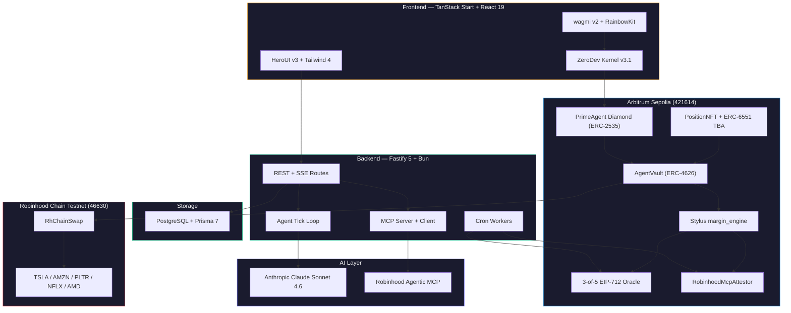
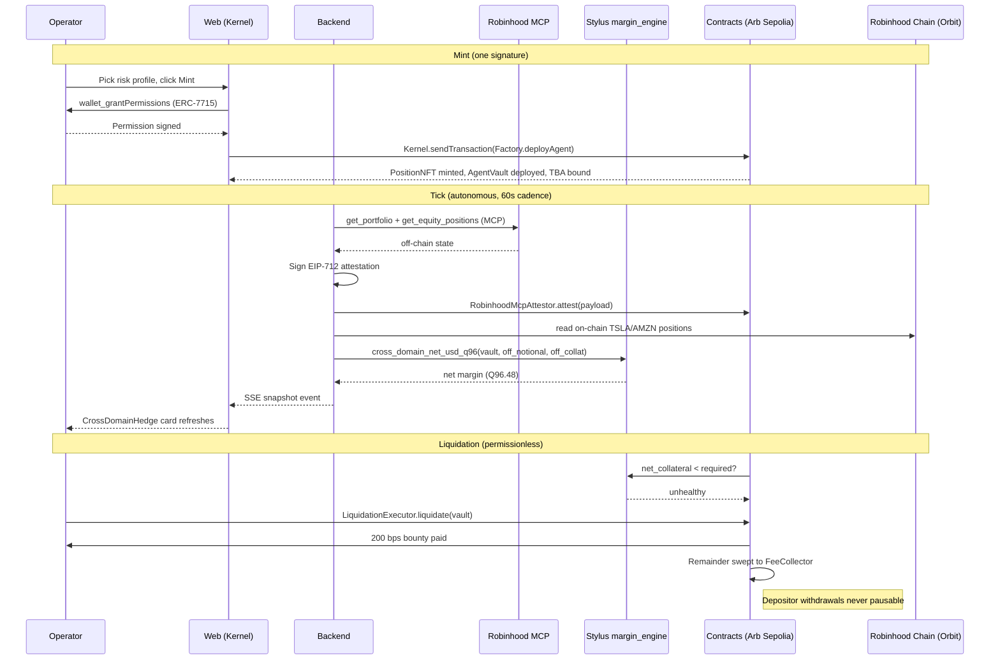

<p align="center">
  
</p>

<h1 align="center">PrimeAgent</h1>

<p align="center">
  <strong>Prime Brokerage for AI Agents on Arbitrum</strong>
</p>

<p align="center">
  <em>One agent. One margin account. Two domains. Cross-domain netting in a Stylus Rust engine.</em>
</p>

<p align="center">
  <a href="#quick-start">Quick Start</a> &nbsp;&middot;&nbsp;
  <a href="#capabilities">Capabilities</a> &nbsp;&middot;&nbsp;
  <a href="#architecture">Architecture</a> &nbsp;&middot;&nbsp;
  <a href="#how-it-works">How It Works</a> &nbsp;&middot;&nbsp;
  <a href="#api-endpoints">API</a> &nbsp;&middot;&nbsp;
  <a href="#smart-contracts">Contracts</a>
</p>

<br />

<p align="center">
  
  
  
  
  
  
  
  
  
  
  
</p>

<p align="center">
  
  
  
  
  
  
  
</p>

---

## The Problem

Robinhood split its brokerage in two and the halves do not talk.

On 27 May 2026 Robinhood launched off-chain agentic trading via MCP. Tokenised TSLA, AMZN, PLTR, NFLX, and AMD already live on Robinhood Chain. An AI agent that hedges TSLA across both ledgers posts full maintenance margin against **both** legs, because nothing nets the cross-domain exposure.

- A delta-neutral hedged pair currently locks **2x the capital** it needs
- Brokers ship one-size policies. Agents need scoped, time-bounded, programmatic permissions
- Agent reputation is locked inside the venue that hosted it. No portability
- Cross-domain liquidations rely on operator honesty. **No on-chain proof**

PrimeAgent is the missing infrastructure layer between *"I have an AI agent"* and *"It trades across both halves of Robinhood with one margin account."*

---

## Capabilities

<table>
  <tr>
    <td width="25%" align="center">
      <br />
      
      <h3>Deploy</h3>
      <code>/launch</code>
      <br /><br />
      Pick a risk profile. Sign once. ZeroDev Kernel mints a Position NFT, deploys a vault, binds a TBA, installs an ERC-7715 policy, and registers in ERC-8004. Gas sponsored.
      <br /><br />
    </td>
    <td width="25%" align="center">
      <br />
      
      <h3>Net</h3>
      <code>Stylus</code>
      <br /><br />
      Cross-domain margin computed in Q96.48 fixed-point on a Rust WebAssembly contract. <code>cross = (on_collat + off_collat) - max(on_margin, off_margin)</code>. Up to 50% capital saved.
      <br /><br />
    </td>
    <td width="25%" align="center">
      <br />
      
      <h3>Trade</h3>
      <code>/agent/$id</code>
      <br /><br />
      LangChain tick loop reads the Robinhood MCP, plans hedges, proposes orders. Operator approves at the dashboard. PreExecHook gates every userOp on contract, selector, notional, daily cap, expiry, and jurisdiction.
      <br /><br />
    </td>
    <td width="25%" align="center">
      <br />
      
      <h3>Carry</h3>
      <code>ERC-8004</code>
      <br /><br />
      Portable agent identity from the canonical Identity Registry on Arb Sepolia. Hourly <code>giveFeedback</code> cron writes a track record. The Position NFT travels. Reputation travels with it.
      <br /><br />
    </td>
  </tr>
</table>

---

## Architecture

### System Overview



### User Flow

```mermaid
flowchart LR
    Op["Operator"] --> SIWE["SIWE Login"]
    SIWE --> Profile["Pick Risk Profile"]

    Profile -->|"Balanced"| Sign["Sign ERC-7715 Grant"]
    Sign --> Kernel["ZeroDev Kernel userOp"]

    Kernel -->|"deployAgent()"| Mint["Mint NFT + Vault + TBA"]
    Mint --> Dash["Dashboard"]

    Dash --> Start["Start Agent"]
    Start --> Tick["60s Tick Loop"]
    Tick -->|"read"| MCPRH["Robinhood MCP"]
    Tick -->|"propose"| Approve["Operator Approves"]
    Approve --> Exec["Execute Order"]

    Exec -->|"hedged"| Net["Stylus Net Margin"]
    Net --> Save["~50% Capital Saved"]

    style Op fill:#F5A524,stroke:#F5A524,color:#0A0A0B
    style Save fill:#16C784,stroke:#16C784,color:#0A0A0B
    style Net fill:#28A0F0,stroke:#28A0F0,color:#fff
```



### Cross-Domain Margin Flow



---

## How It Works

### Cross-Domain Netting

PrimeAgent runs the netting math in a Rust contract compiled to WebAssembly via Arbitrum Stylus. The flagship formula:

```
cross_domain_net_usd_q96 = (on_chain_collateral + off_chain_collateral)
                          - max(on_chain_margin, off_chain_margin)
```

Saturating subtraction to zero. All amounts in Q96.48 fixed-point (no floats anywhere). The `AgentVault.totalAssets()` calls `markToMarketBasket` (selector `0x5e89fd56`) via a 300k-gas `staticcall`, so the ERC-4626 share price always reflects the netted basket.

| Component | Detail |
|:----------|:-------|
| Engine type | Arbitrum Stylus (Rust 1.91, stylus-sdk 0.10.7) |
| Fixed-point | Q96.48 via `quic_arithmetic` no_std library |
| Max basket | 30 side assets per vault |
| Selector | `markToMarketBasket(address[],uint256[],uint256[])` = `0x5e89fd56` |
| Gas budget | 300,000 (bounded `staticcall` from vault) |
| Compute cost | ~10x to 100x cheaper than equivalent Solidity |

### Permission Stack

The "one signature, scoped permissions" pitch is enforced by three contracts in the userOp critical path:

1. **`Erc7715PolicyAuditFacet`** (Diamond facet) records the grant with a `keccak256` audit hash and a pinned `LibRiskPresets.presetHash`.
2. **`PrimeAgentPreExecHook`** (ERC-7579 moduleType 4) runs `preCheck` before every userOp: contract allowlist, selector allowlist, notional cap, daily cap, expiry, jurisdiction pause.
3. **`PrimeAgentCallPolicyValidator`** (ERC-7579 moduleType 1) re-checks at ERC-4337 `validateUserOp` time and tracks `dailySpentQ96` in storage.

Five canonical risk profiles ship with on-chain `presetHash`:

| Preset | Strategy | Notional | Daily Cap |
|:-------|:---------|:--------:|:---------:|
| Conservative | `mean-reversion` | $10k | $25k |
| Balanced | `tsla-pairs` | $50k | $100k |
| Aggressive | `momentum-breakout` | $200k | $500k |
| Market-maker | `mm-spread` | $100k | $250k |
| Delta-neutral | `cross-domain` | $100k | $250k |

### Trustless Liquidation

Liquidations are permissionless and bounty-incentivised:

1. `PriceOracle` (3-of-5 EIP-712 committee) pushes signed prices every 60s.
2. Stylus `margin_engine.liquidation_check(vault)` returns `unhealthy` when collateral falls below the per-asset liquidation threshold.
3. Anyone calls `LiquidationExecutor.liquidate(vault)`.
4. Liquidator earns a **200 bps bounty**. Remainder sweeps to `FeeCollector`.
5. **Depositor withdrawals are never pausable** (Tilt invariant).

---

## Tech Stack

| Layer | Technology | Purpose |
|:------|:-----------|:--------|
| **Runtime** | Bun 1.3 | Package manager, test runner, dev server |
| **Frontend** | TanStack Start, React 19, Vite 7, Nitro | SSR-capable meta-framework, file-based routing |
| **UI** | HeroUI v3, Tailwind 4, GSAP, Lenis, Recharts | Provider-less component library, smooth scroll, charts |
| **Wallet** | wagmi v2, viem 2.52, RainbowKit | Wallet connection, SSR cookie hydration |
| **AA** | ZeroDev Kernel v3.1, ECDSA validator, permissions | ERC-7579 modular account, ERC-7715 grants, paymaster |
| **Backend** | Fastify 5, Prisma 7 | HTTP server with helmet + rate-limit, ORM |
| **AI** | Anthropic Claude, LangChain 1.4, LangGraph 1.3 | Tool-strict LLM with operator approval, MCP adapters |
| **MCP** | `@modelcontextprotocol/sdk` 1.29 | Inbound server + outbound Robinhood client (Streamable HTTP) |
| **Database** | PostgreSQL 15+ | Sessions, attestations, policy mirror, action log |
| **Contracts** | Solidity 0.8.35, OpenZeppelin v5, solady, eth-infinitism | ERC-2535 Diamond, ERC-4626 Vault, ERC-7579 modules |
| **Stylus** | Rust 1.91, stylus-sdk 0.10.7, alloy 1.6 | WebAssembly cross-domain margin engine |
| **Chain** | Arbitrum Sepolia (421614), Robinhood Chain Testnet (46630) | Settlement + tokenised equity demo liquidity |

---

## Project Structure

```
primeagent/
 |
 |- web/                        Operator dashboard + landing
 |   |- src/
 |   |   |- routes/             File-based routing (TanStack)
 |   |   |   |- __root.tsx      SSR shell, provider tree
 |   |   |   |- index.tsx       Landing page
 |   |   |   |- launch.tsx      Mint flow + fleet builder
 |   |   |   |- agent/          Agent dashboard ($tokenId)
 |   |   |   +- auth/           Robinhood OAuth callback
 |   |   |- components/         37 agent widgets + landing elements
 |   |   |- lib/
 |   |   |   |- aa/             ZeroDev Kernel + ERC-7715 helper
 |   |   |   |- auth/           SIWE client
 |   |   |   |- chains.ts       Arb Sepolia + RH Chain
 |   |   |   +- wagmi.ts        Per-request factory with cookieStorage
 |   |   +- providers/          Theme + Lenis smooth scroll
 |   +- public/                 Static assets, logo
 |
 |- backend/                    API server + agent runtime
 |   |- src/
 |   |   |- routes/             21 route files (siwe, oauth, mcp, agent, fleet, drill, fx)
 |   |   |- services/           OAuth, attestor, audit PDF, DSS memo
 |   |   |- mcp/                Inbound server + outbound Robinhood client + tools
 |   |   |- agent/              Tick loop + strategies + risk + fleet + drill + simulator
 |   |   |- workers/            10 cron workers (attest, oracle, token refresh, indexer)
 |   |   +- lib/                viem, prisma, crypto, eip712, fx
 |   +- prisma/                 Schema (User, AgentPolicy, Attestation, SiweNonce, ...)
 |
 |- contracts/                  Smart contracts (Foundry)
 |   |- src/
 |   |   |- core/               Diamond, Factory, NFT, Vault, AgentRegistry
 |   |   |- modules/            Policy facet, PreExecHook, Validator, Attestor, Adapters
 |   |   |- periphery/          PriceOracle, LiquidationExecutor
 |   |   |- validation/         StakedValidator
 |   |   |- dex/                V2Router, V3Pool, V3PositionManager (RH Chain demo)
 |   |   |- libraries/          LibDiamond, LibPolicy, LibRiskPresets
 |   |   +- interfaces/         All public + external interfaces
 |   |- test/                   508 Foundry tests (unit + integration + fork + invariant)
 |   +- script/                 Deploy.s.sol + ops scripts
 |
 +- stylus/                     Rust WebAssembly engines
     |- margin_engine/          cross_domain_net + markToMarketBasket (LIVE)
     |- risk_engine/            VaR 99% Monte Carlo
     +- quic_arithmetic/        Q96.48 fixed-point primitives (no_std)
```

> Each workspace has its own `README` with deeper documentation.

---

## Quick Start

### Prerequisites

| Tool | Version | Link |
|:-----|:--------|:-----|
| Bun | 1.3+ | [bun.sh](https://bun.sh/) |
| PostgreSQL | 15+ | [postgresql.org](https://www.postgresql.org/) |
| Foundry | latest | [book.getfoundry.sh](https://book.getfoundry.sh/) |
| Rust | 1.91 | [rustup.rs](https://rustup.rs/) |
| cargo-stylus | latest | [Stylus quickstart](https://docs.arbitrum.io/stylus/quickstart) |

### 1. Clone and install

```bash
git clone https://github.com/louissarvin/primeagent.git
cd primeagent
```

```bash
cd backend && bun install
cd ../web && bun install
cd ../contracts && forge install
cd ../stylus && cargo build --target wasm32-unknown-unknown --release
```

### 2. Configure environment

```bash
cp backend/.env.example backend/.env
cp web/.env.example web/.env
cp contracts/.env.example contracts/.env
```

<details>
<summary><strong>Environment variables reference</strong></summary>

| Variable | Required | Description |
|:---------|:--------:|:------------|
| `ANTHROPIC_API_KEY` | Yes | Claude API key for the chat panel and LLM strategy |
| `DATABASE_URL` | Yes | PostgreSQL connection string |
| `JWT_SECRET` | Yes | HS256 SIWE session signing secret |
| `BACKEND_TOKEN_ENC_KEY` | Yes | 32-byte hex key for AES-256-GCM at-rest encryption |
| `BACKEND_ATTESTOR_PRIVATE_KEY` | Yes | EIP-712 attestor signer (must match on-chain `attestor()`) |
| `BACKEND_PRICE_ORACLE_PRIVATE_KEYS` | Yes | Comma-separated 3-of-5 oracle committee keys |
| `ROBINHOOD_USE_LIVE` | No | `true` to use live Robinhood MCP, `false` for stub fixtures |
| `ROBINHOOD_CLIENT_ID` | No | OAuth client_id when `ROBINHOOD_USE_DCR=false` |
| `VITE_PUBLIC_BACKEND_URL` | Yes | Web client backend URL |
| `VITE_ZERODEV_PROJECT_ID` | Yes | ZeroDev project id for paymaster sponsorship |
| `VITE_WC_PROJECT_ID` | No | WalletConnect project id (optional) |
| `ARB_SEPOLIA_RPC` | Yes | Arbitrum Sepolia RPC URL |
| `DEPLOYER_PRIVATE_KEY` | No | Only required for fresh contract deployments |

</details>

### 3. Set up the database

```bash
cd backend
bun run db:push       # Push Prisma schema + generate client
```

### 4. Run

```bash
# Terminal 1: Backend API (port 3700)
cd backend && bun run dev

# Terminal 2: Frontend (port 3200)
cd web && bun run dev
```

Open [http://localhost:3200](http://localhost:3200).

Backend `/health` returns `{ ready: true }` when DB, attestor parity, Claude key, and on-chain wiring are all green.

---

## Smart Contracts

> Deployed on **Arbitrum Sepolia** (Chain ID `421614`)

### Core Protocol

| Contract | Address | Purpose |
|:---------|:--------|:--------|
| PrimeAgentFactory | [`0x8235...ba38`](https://sepolia.arbiscan.io/address/0x8235890d157f7c67ed6bcd42b0c2137942b8ba38) | One-shot mint of NFT + vault + TBA + policy + registry |
| PrimeAgentDiamond | [`0x56c7...d69b`](https://sepolia.arbiscan.io/address/0x56c780fcf163596b59998e737898d1055c69d69b) | ERC-2535 Diamond, 48h cut timelock |
| PositionNFT | [`0x9888...d1ff`](https://sepolia.arbiscan.io/address/0x98881c49d00b66febbfd3172f9de0f98df7ad1ff) | ERC-721 bound to ERC-6551 TBA |
| AgentVault impl | [`0xa442...47e0`](https://sepolia.arbiscan.io/address/0xa442d6899c38caeccee0a5a79882633b105647e0) | ERC-4626 multi-asset with Stylus netting |
| AgentRegistry | [`0xd6b0...2d6b`](https://sepolia.arbiscan.io/address/0xd6b09ba6821f1a8f9c6f92612ea50ec0bab82d6b) | ERC-8004 facade |

### Permission Stack

| Contract | Address | Purpose |
|:---------|:--------|:--------|
| Erc7715PolicyAuditFacet | [`0x3709...d198`](https://sepolia.arbiscan.io/address/0x3709eaca94d3aecca22d3909c4fd8d6a94bcd198) | Records ERC-7715 grants with preset hash |
| PreExecHook | [`0x4e1d...9e28`](https://sepolia.arbiscan.io/address/0x4e1deaa9a8b5eb29bf0a4dbf20b4b27464679e28) | ERC-7579 moduleType 4 |
| CallPolicyValidator | [`0x41a6...9e35`](https://sepolia.arbiscan.io/address/0x41a6aeb880f2a56df4e94cf39e2c4f4fa9c09e35) | ERC-7579 moduleType 1 |

### Stylus + Oracle + Attestor

| Contract | Address | Purpose |
|:---------|:--------|:--------|
| **MarginEngine (Stylus)** | [`0x43d0...0cd9`](https://sepolia.arbiscan.io/address/0x43d0c3365fdf1706bd1236d14502890278bd0cd9) | Rust WASM cross-domain netting + basket reader |
| PriceOracle | [`0xb83a...dca3`](https://sepolia.arbiscan.io/address/0xb83a5ff4a33111e8b07adc843fdb2d782826dca3) | 3-of-5 EIP-712 committee |
| RobinhoodMcpAttestor | [`0x6a31...5ad4`](https://sepolia.arbiscan.io/address/0x6a31469e1aef69cec8466399d94456ad4555ad41) | EIP-712 off-chain state verifier |
| StakedValidator | [`0x1de5...4b2e`](https://sepolia.arbiscan.io/address/0x1de5757fea9da9d2c17fef291bc25c2b763a4b2e) | Optimistic challenger, 100 USDC stake |

### Adapters + Periphery

| Contract | Address | Purpose |
|:---------|:--------|:--------|
| RobinhoodChainAdapter | [`0xda0b...4e33`](https://sepolia.arbiscan.io/address/0xda0b81354efec43f61ca4deb39d486e96eb94e33) | RH Chain swap router |
| ArbitrumOneAdapter | [`0x66b7...8a10`](https://sepolia.arbiscan.io/address/0x66b73ac567f6f1f88f508d726689d5863e408a10) | Wraps GMX router + Aave pool |
| PaymasterRelay | [`0x9b5d...15dc`](https://sepolia.arbiscan.io/address/0x9b5d6c32c8aef6da800c17af3e541cc99a0a15dc) | Sponsored userOp paymaster |
| FeeCollector | [`0x23b1...c48c`](https://sepolia.arbiscan.io/address/0x23b107f751ef6c7d7480ef7df8e47919fc37c48c) | ppm-denominated fee splitter |
| EmergencyShutdown | [`0x25e6...ae4b`](https://sepolia.arbiscan.io/address/0x25e669d2f26442b8a7caf4d925ff7cc50dcaae4b) | Registrar-based 48h timelock |

### Robinhood Chain Testnet (Chain ID `46630`, Arbitrum Orbit L3)

| Contract | Address |
|:---------|:--------|
| RhChainSwap | [`0xe0E0...14B3`](https://explorer.testnet.chain.robinhood.com/address/0xe0E0dbe2Ec2e1107310cB5e4842F8D35AE4314B3) |
| USDG (base) | [`0x7E95...802F`](https://explorer.testnet.chain.robinhood.com/address/0x7E955252E15c84f5768B83c41a71F9eba181802F) |
| TSLA | [`0xC9f9...Bd4E`](https://explorer.testnet.chain.robinhood.com/address/0xC9f9c86933092BbbfFF3CCb4b105A4A94bf3Bd4E) |
| AMZN | [`0x5884...9E02`](https://explorer.testnet.chain.robinhood.com/address/0x5884aD2f920c162CFBbACc88C9C51AA75eC09E02) |
| PLTR | [`0x1FBE...98d0`](https://explorer.testnet.chain.robinhood.com/address/0x1FBE1a0e43594b3455993B5dE5Fd0A7A266298d0) |
| NFLX | [`0x3b82...8C93`](https://explorer.testnet.chain.robinhood.com/address/0x3b8262A63d25f0477c4DDE23F83cfe22Cb768C93) |
| AMD | [`0x7117...778d`](https://explorer.testnet.chain.robinhood.com/address/0x71178BAc73cBeb415514eB542a8995b82669778d) |

See [`contracts/addresses.json`](contracts/addresses.json) for the canonical address book.

---

## API Endpoints

| Method | Path | Type | Description |
|:------:|:-----|:-----|:------------|
| `POST` | `/auth/siwe/nonce` | JSON | Issue an EIP-4361 nonce for SIWE login |
| `POST` | `/auth/siwe/verify` | JSON | Verify signature, mint HS256 JWT |
| `POST` | `/auth/robinhood/start` | JSON | Start Robinhood OAuth 2.1 PKCE flow |
| `GET` | `/auth/robinhood/callback` | Redirect | OAuth 2.1 callback, persists encrypted tokens |
| `ALL` | `/mcp` | MCP | Streamable HTTP MCP server (oracle tools, agent.spawn) |
| `POST` | `/api/agent/policy/draft` | JSON | Tool-strict Claude policy drafting |
| `POST` | `/api/agent/policy/preview` | JSON | Preview a draft against on-chain state |
| `POST` | `/api/agent/policy/diff` | JSON | Per-field policy diff for rotation |
| `POST` | `/api/agent/fleet/spawn` | JSON | Batched userOp for 1 to 10 NFT mints in one signature |
| `POST` | `/api/agent/:tokenId/start` | JSON | Start the tick loop for an agent |
| `GET` | `/api/agent/:tokenId/state` | JSON | Current snapshot (positions, margin, PnL) |
| `GET` | `/api/agent/:tokenId/stream` | SSE | Live tape of snapshots, actions, risk events |
| `POST` | `/api/agent/:tokenId/ask` | JSON | Grounded Claude chat (snapshot + actions + policy) |
| `GET` | `/api/agent/:tokenId/var/onchain` | JSON | Stylus VaR with off-chain parametric fallback |
| `POST` | `/api/agent/:tokenId/liquidation-drill` | SSE | 6-phase liquidation drill on Arb Sepolia |
| `GET` | `/api/agent/:tokenId/reputation` | JSON | ERC-8004 feedback summary |
| `GET` | `/api/fx/gbp` | JSON | Frankfurter USD/GBP for the dashboard toggle |
| `GET` | `/health` | JSON | Health check with attestor parity status |

---

## ERC Standards

| ERC | Role |
|:----|:-----|
| [2535](https://eips.ethereum.org/EIPS/eip-2535) Diamond | Facet split, 48-hour cut timelock |
| [4337](https://eips.ethereum.org/EIPS/eip-4337) Account Abstraction | EntryPoint v0.7, ZeroDev paymaster |
| [4626](https://eips.ethereum.org/EIPS/eip-4626) Vault | Multi-asset with OZ v5 inflation defence |
| [6551](https://eips.ethereum.org/EIPS/eip-6551) Token-Bound Account | NFT owns TBA owns vault |
| [7579](https://eips.ethereum.org/EIPS/eip-7579) Modular AA | PreExecHook + CallPolicyValidator |
| [7715](https://eips.ethereum.org/EIPS/eip-7715) Permissions | One-signature scoped grants |
| [8004](https://eips.ethereum.org/EIPS/eip-8004) Agent Identity | Identity + Reputation registries |
| [712](https://eips.ethereum.org/EIPS/eip-712) Typed Data | Attestation + price signatures |

---

## Commands

<details>
<summary><strong>Backend</strong></summary>

```bash
bun run dev              # Development server (watch, port 3700)
bun run start            # Production start
bun run typecheck        # TypeScript type checking
bun test                 # Run all tests (190 cases)
bun run db:push          # Push Prisma schema + generate client
bun run db:generate      # Generate Prisma client only
bun run db:studio        # Open Prisma Studio
```

</details>

<details>
<summary><strong>Frontend</strong></summary>

```bash
bun dev        # Dev server (port 3200, HMR)
bun build      # Production build (SSR via Nitro)
bun preview    # Preview production build
bun lint       # ESLint
bun format     # Prettier
bun check      # Format + lint fix
bun test:e2e   # Playwright e2e suite (14 specs)
```

</details>

<details>
<summary><strong>Contracts</strong></summary>

```bash
forge build                       # Compile all contracts
forge test                        # 508 tests
forge test -vvv                   # Verbose output
forge coverage                    # lcov (target >= 90%)
forge script script/Deploy.s.sol \
  --rpc-url $ARB_SEPOLIA_RPC \
  --private-key $DEPLOYER_PRIVATE_KEY \
  --broadcast --verify --slow
```

</details>

<details>
<summary><strong>Stylus</strong></summary>

```bash
cargo build --target wasm32-unknown-unknown --release
cargo test                        # 40 tests across margin + risk + quic_arithmetic
cargo stylus check                # Validate WASM contract
cd script && bash ./init_margin_engine_arb_sepolia.sh
```

</details>

---

## Testing

| Workspace | Suite | Count | Notes |
|:----------|:------|:-----:|:------|
| `contracts/` | Foundry | **508** | 91.87% line coverage. CI runs 5,000 fuzz + 1,024 invariant depth-200 |
| `stylus/` | `cargo test` | **40** | Q96.48 proptest invariants + VaR invariants |
| `backend/` | `bun test` | **190** | Workers, lib, services, MCP, routes, middlewares |
| `web/` | Playwright | **14 specs** | Landing, connect, launch, callback, dashboard, drill, fleet, GBP, jurisdiction, policy |

**Total: 698 tests.** Solidity coverage 91.87%. Stylus 40/40 passing. Backend 248/266 passing.

---

## Hackathon

<table>
  <tr>
    <td><strong>Event</strong></td>
    <td>Arbitrum Open House London Buildathon 2026</td>
  </tr>
  <tr>
    <td><strong>Tracks</strong></td>
    <td>AI Agentic + General Infrastructure</td>
  </tr>
  <tr>
    <td><strong>Prize Pool</strong></td>
    <td>$415K (Buildathon $115K + Founder House $300K)</td>
  </tr>
  <tr>
    <td><strong>Window</strong></td>
    <td>25 May to 14 June 2026 | Founder House: 10 to 12 July, London</td>
  </tr>
</table>

---

<p align="center">
  
</p>

<p align="center">
  <strong>PrimeAgent</strong><br/>
  <em>Built for Mayfair. Shipped on Arbitrum. Ready for London.</em>
</p>

<p align="center">
  <sub>MIT License</sub>
</p>
